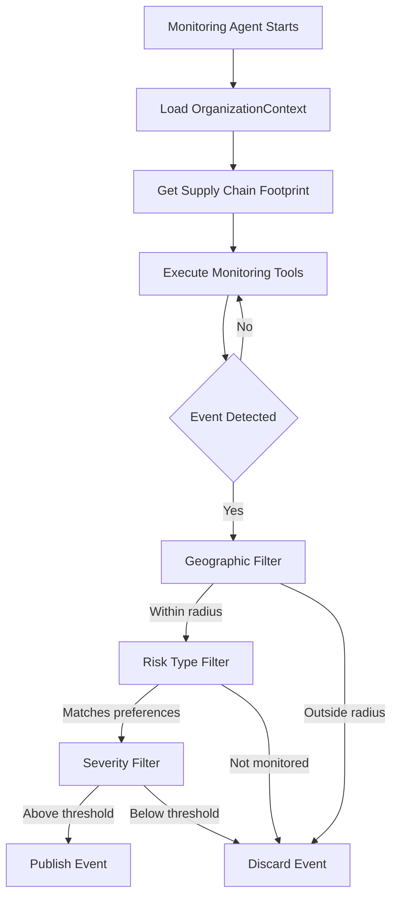

# OrganizationContext Documentation

## Table of Contents
- [Overview](#overview)
- [Purpose](#purpose)
- [Data Structure](#data-structure)
- [How It Works](#how-it-works)
- [Use Cases](#use-cases)
- [Configuration](#configuration)
- [ERP Sync](#erp-sync)
- [Examples](#examples)
- [API Reference](#api-reference)

---

## Overview

**OrganizationContext** is the central configuration and context store that makes the Pericles monitoring system **tenant-aware** and **business-specific**. It acts as the "brain" that tells AI agents what matters to each organization.

### Key Concept

Instead of monitoring the entire world for every risk, OrganizationContext enables **personalized, intelligent monitoring** by storing:
- **WHERE** your business operates (supply chain footprint)
- **WHAT** risks matter to you (monitoring preferences)
- **HOW SENSITIVE** the monitoring should be (thresholds)

---

## Purpose

### The Problem

Without context, a monitoring system would:
- ❌ Alert on every factory fire worldwide (99% irrelevant)
- ❌ Monitor all ports equally (you only ship through 5)
- ❌ Track all suppliers (you only have 50, not 50,000)
- ❌ Use generic thresholds (every business has different risk tolerance)

### The Solution

OrganizationContext provides:
- ✅ **Geographic Scoping**: Only monitor within X km of your locations
- ✅ **Entity Filtering**: Focus on YOUR plants, suppliers, shipping lanes
- ✅ **Risk Personalization**: Track only the risk types that matter to you
- ✅ **Threshold Tuning**: Set severity levels based on your risk appetite

---

## Data Structure

### Database Schema

```prisma
model OrganizationContext {
  id                    String   @id @default(uuid())
  organization_id       String   @unique

  // Supply Chain Footprint (ERP-synced)
  plants                Json     // Manufacturing facilities
  warehouses            Json     // Distribution centers
  suppliers             Json     // Supplier network
  shipping_lanes        Json     // Key logistics routes

  // Monitoring Preferences
  monitored_risk_types  String[] // Specific risks to track
  geographic_radius_km  Float    // Proximity threshold
  severity_threshold    Float    // Minimum severity (0.0-1.0)

  // Business Context
  strategic_documents   Json?    // Risk policies, annual plans
  last_erp_sync         DateTime?

  created_at            DateTime @default(now())
  updated_at            DateTime @updatedAt
}
```

### Field Descriptions

#### Supply Chain Footprint

**`plants`** (JSON Array)
```json
[
  {
    "plant_id": "P-001",
    "name": "Shanghai Manufacturing Plant",
    "location": {
      "city": "Shanghai",
      "country": "China",
      "latitude": 31.2304,
      "longitude": 121.4737
    },
    "criticality": "high"
  }
]
```
- **Purpose**: Track manufacturing facilities for proximity-based risk monitoring
- **Source**: ERP system (SAP, Oracle, etc.)
- **Used For**: Geographic filtering, impact assessment

**`warehouses`** (JSON Array)
```json
[
  {
    "warehouse_id": "W-003",
    "name": "Los Angeles Distribution Center",
    "location": {
      "city": "Los Angeles",
      "country": "USA",
      "latitude": 34.0522,
      "longitude": -118.2437
    }
  }
]
```
- **Purpose**: Monitor distribution and storage facilities
- **Source**: ERP/WMS systems
- **Used For**: Port congestion alerts, regional disruption tracking

**`suppliers`** (JSON Array)
```json
[
  {
    "supplier_id": "SUP-047",
    "name": "Vietnam Textiles Ltd",
    "location": {
      "city": "Ho Chi Minh City",
      "country": "Vietnam",
      "latitude": 10.8231,
      "longitude": 106.6297
    },
    "tier": 1
  }
]
```
- **Purpose**: Core supply chain dependencies
- **Source**: ERP, supplier management system
- **Used For**: Supplier-specific risk detection (factory fires, strikes, floods)

**`shipping_lanes`** (JSON Array)
```json
[
  {
    "lane_id": "LANE-012",
    "origin": "Shanghai",
    "destination": "Los Angeles",
    "key_ports": ["Shanghai Port", "Long Beach Port"]
  }
]
```
- **Purpose**: Critical logistics routes
- **Source**: TMS (Transportation Management System)
- **Used For**: Port closure alerts, shipping delay detection

#### Monitoring Preferences

**`monitored_risk_types`** (String Array)
```json
["flood", "strike", "port_closure", "factory_fire", "typhoon"]
```
- **Purpose**: Filter events to only relevant risk categories
- **Default**: `[]` (empty = monitor all risk types)
- **Options**:
  - Weather: `flood`, `typhoon`, `hurricane`, `earthquake`
  - Operational: `factory_fire`, `explosion`, `accident`
  - Political: `strike`, `protest`, `civil_unrest`, `coup`
  - Logistics: `port_closure`, `port_congestion`, `shipping_delay`
  - Economic: `tariff`, `sanction`, `currency_crisis`
  - Health: `pandemic`, `outbreak`, `lockdown`

**`geographic_radius_km`** (Float)
- **Purpose**: How far from your locations to monitor (in kilometers)
- **Default**: `100` km
- **Range**: `1-5000` km
- **Example**:
  - `50` km = Very focused (immediate vicinity)
  - `100` km = Balanced (default)
  - `500` km = Regional coverage
  - `5000` km = Continental coverage

**`severity_threshold`** (Float)
- **Purpose**: Minimum event severity to alert on (0.0 = all, 1.0 = only critical)
- **Default**: `0.5` (medium and above)
- **Range**: `0.0-1.0`
- **Scale**:
  - `0.0-0.3`: Low (warnings, minor delays)
  - `0.4-0.6`: Medium (significant delays, localized disruption)
  - `0.7-0.9`: High (major disruption, widespread impact)
  - `0.9-1.0`: Critical (catastrophic events, supply chain collapse)

#### Business Context

**`strategic_documents`** (JSON Object)
```json
{
  "risk_policy": "s3://bucket/risk-policy-2025.pdf",
  "business_continuity_plan": "s3://bucket/bcp-2025.pdf",
  "annual_risk_assessment": "s3://bucket/risk-assessment-2024.pdf"
}
```
- **Purpose**: References to business documents for context
- **Optional**: Can be null
- **Used For**: AI agents can reference these for better risk interpretation

**`last_erp_sync`** (DateTime)
- **Purpose**: Track data freshness
- **Updated**: Every time ERP sync runs
- **Used For**: Alerting when data is stale (>7 days)

---

## How It Works

### Monitoring Agent Workflow



### Step-by-Step Example

**Scenario**: Typhoon detected in Vietnam

**1. Load Context**
```typescript
const context = await erpContextTool.execute({
  organization_id: "levi-strauss-uuid"
});
// Returns: 22 suppliers, geographic_radius_km: 100, severity_threshold: 0.5
```

**2. Event Detected**
```json
{
  "type": "typhoon",
  "title": "Super Typhoon Haiyan approaching Vietnam",
  "location": {
    "latitude": 10.8231,
    "longitude": 106.6297
  },
  "severity": 0.85
}
```

**3. Geographic Filter**
```typescript
const distances = context.suppliers.map(supplier =>
  calculateDistance(event.location, supplier.location)
);
// Supplier #7 (Vietnam Textiles): 12 km ✓
// Supplier #12 (Bangladesh Garments): 1,847 km ✗
```
**Result**: Event is within 100km of Supplier #7 → **PASS**

**4. Risk Type Filter**
```typescript
if (context.monitored_risk_types.length === 0 ||
    context.monitored_risk_types.includes("typhoon")) {
  // PASS
}
```
**Result**: No specific risk filters set → **PASS**

**5. Severity Filter**
```typescript
if (event.severity >= context.severity_threshold) {
  // 0.85 >= 0.5 → PASS
}
```
**Result**: Severity 0.85 exceeds threshold 0.5 → **PASS**

**6. Publish Event**
```typescript
await storeEvent({
  organization_id: "levi-strauss-uuid",
  event_type: "typhoon",
  severity: 0.85,
  affected_entities: ["Supplier #7: Vietnam Textiles"],
  distance_km: 12
});
```

### Counter-Example: Filtered Out

**Scenario**: Minor strike in Brazil

```json
{
  "type": "strike",
  "title": "Factory workers strike in São Paulo",
  "location": { "latitude": -23.5505, "longitude": -46.6333 },
  "severity": 0.3
}
```

**Geographic Filter**:
- Nearest supplier: 17,842 km away
- Threshold: 100 km
- **FAIL** → Event discarded

---

## Use Cases

### 1. Apparel Company (Levi Strauss)

**Context Configuration**:
```json
{
  "organization_id": "levi-strauss-uuid",
  "suppliers": [
    { "name": "Vietnam Textiles", "location": { "country": "Vietnam" } },
    { "name": "Bangladesh Garments", "location": { "country": "Bangladesh" } },
    { "name": "China Manufacturing", "location": { "country": "China" } }
  ],
  "monitored_risk_types": ["flood", "strike", "factory_fire", "typhoon"],
  "geographic_radius_km": 100,
  "severity_threshold": 0.5
}
```

**Monitored Risks**:
- ✅ Typhoon near Vietnam supplier
- ✅ Factory fire in Bangladesh
- ✅ Labor strike in China facility
- ❌ Hurricane in Caribbean (no suppliers there)

---

### 2. Electronics Company (Apple)

**Context Configuration**:
```json
{
  "organization_id": "apple-uuid",
  "suppliers": [
    { "name": "Foxconn", "location": { "country": "China" } },
    { "name": "TSMC", "location": { "country": "Taiwan" } }
  ],
  "monitored_risk_types": [
    "earthquake",
    "port_closure",
    "chip_shortage",
    "geopolitical_tension"
  ],
  "geographic_radius_km": 200,
  "severity_threshold": 0.7
}
```

**Monitored Risks**:
- ✅ Earthquake near TSMC facility (severity 0.8)
- ✅ Port congestion in Shanghai (affects Foxconn)
- ✅ Taiwan Strait geopolitical tensions
- ❌ Minor labor dispute (severity 0.4 < threshold 0.7)

---

### 3. Automotive Company (Tesla)

**Context Configuration**:
```json
{
  "organization_id": "tesla-uuid",
  "plants": [
    { "name": "Gigafactory Shanghai", "location": { "country": "China" } },
    { "name": "Gigafactory Berlin", "location": { "country": "Germany" } }
  ],
  "suppliers": [
    { "name": "Panasonic Batteries", "location": { "country": "Japan" } },
    { "name": "Lithium Mines Chile", "location": { "country": "Chile" } }
  ],
  "monitored_risk_types": [
    "energy_grid_failure",
    "lithium_shortage",
    "chip_shortage",
    "port_closure"
  ],
  "geographic_radius_km": 500,
  "severity_threshold": 0.6
}
```

**Monitored Risks**:
- ✅ Power grid issues near Gigafactory
- ✅ Lithium mine strike in Chile
- ✅ Chip shortage affecting production
- ❌ Factory fire 600km away (outside 500km radius)

---

## Configuration

### Default Configuration

When an OrganizationContext is created, it uses these defaults:

```typescript
{
  plants: [],
  warehouses: [],
  suppliers: [],
  shipping_lanes: [],
  monitored_risk_types: [],  // Monitor all risks
  geographic_radius_km: 100,  // 100km radius
  severity_threshold: 0.5,    // Medium and above
  strategic_documents: null,
  last_erp_sync: null
}
```

### Configuration Precedence

The monitoring system loads configuration with this precedence (highest to lowest):

1. **Runtime Overrides** - Passed directly to `loadMonitoringConfig()`
2. **Database Configuration** - Stored in OrganizationContext table
3. **Default Values** - Hardcoded fallbacks

```typescript
// Example: Override geographic radius at runtime
const config = await loadMonitoringConfig(
  "levi-strauss-uuid",
  {
    geographicFilter: { radiusKm: 200 }  // Override: 200km instead of 100km
  }
);
```

### Updating Configuration

**Via Database**:
```typescript
await prisma.organizationContext.update({
  where: { organization_id: "levi-strauss-uuid" },
  data: {
    geographic_radius_km: 150,
    severity_threshold: 0.6,
    monitored_risk_types: ["flood", "strike", "port_closure"]
  }
});
```

**Via API** (recommended):
```typescript
POST /api/organizations/:id/context
{
  "geographic_radius_km": 150,
  "severity_threshold": 0.6,
  "monitored_risk_types": ["flood", "strike"]
}
```

---

## ERP Sync

### Overview

OrganizationContext is designed to be **synced from your ERP system** (SAP, Oracle, NetSuite, etc.) to maintain an up-to-date view of your supply chain.

### Sync Frequency

**Recommended**: Every 30 minutes

```typescript
// Cron job: */30 * * * * (every 30 minutes)
await syncERPData("levi-strauss-uuid");
```

### Sync Process

```typescript
async function syncERPData(organizationId: string) {
  // 1. Fetch from ERP API
  const erpData = await erpClient.fetchSupplyChainData();

  // 2. Transform to OrganizationContext format
  const suppliers = erpData.suppliers.map(s => ({
    supplier_id: s.id,
    name: s.name,
    location: {
      city: s.city,
      country: s.country,
      latitude: s.lat,
      longitude: s.lng
    },
    tier: s.tier
  }));

  // 3. Update database
  await prisma.organizationContext.update({
    where: { organization_id: organizationId },
    data: {
      suppliers: suppliers,
      plants: erpData.plants,
      warehouses: erpData.warehouses,
      shipping_lanes: erpData.shippingLanes,
      last_erp_sync: new Date()
    }
  });
}
```

### Data Sources

| Data Type | ERP Module | Example Systems |
|-----------|------------|-----------------|
| Plants | Manufacturing | SAP PP, Oracle Manufacturing |
| Warehouses | Warehouse Management | SAP EWM, Manhattan WMS |
| Suppliers | Procurement | SAP MM, Ariba, Coupa |
| Shipping Lanes | Transportation | SAP TM, Oracle OTM |

### Geocoding

Supplier addresses must be geocoded (converted to lat/lng):

```typescript
// Example geocoding with Google Maps API
async function geocodeSupplier(address: string) {
  const response = await googleMaps.geocode({ address });
  return {
    latitude: response.results[0].geometry.location.lat,
    longitude: response.results[0].geometry.location.lng
  };
}
```

**Levi Strauss Example**: We used `levis-strauss-suppliers_geocoded_google.csv` which already contains geocoded locations.

---

## Examples

### Current Levi Strauss Configuration

**Database Query**:
```sql
SELECT
  organization_id,
  geographic_radius_km,
  severity_threshold,
  jsonb_array_length(suppliers::jsonb) as supplier_count,
  last_erp_sync
FROM "OrganizationContext"
WHERE organization_id = '550e8400-e29b-41d4-a716-446655440000';
```

**Result**:
```
organization_id: 550e8400-e29b-41d4-a716-446655440000
geographic_radius_km: 100
severity_threshold: 0.5
supplier_count: 22
last_erp_sync: 2025-12-13T19:48:00Z
```

**Supplier Locations**:
```json
[
  {
    "supplier_id": "sup-1",
    "name": "Vietnam Garment Factory",
    "location": {
      "city": "Ho Chi Minh City",
      "country": "Vietnam",
      "latitude": 10.8231,
      "longitude": 106.6297
    },
    "tier": 1
  },
  {
    "supplier_id": "sup-2",
    "name": "Bangladesh Textile Mill",
    "location": {
      "city": "Dhaka",
      "country": "Bangladesh",
      "latitude": 23.8103,
      "longitude": 90.4125
    },
    "tier": 1
  }
  // ... 20 more suppliers
]
```

### Monitoring Coverage Map

With the current configuration, Pericles monitors:

**Geographic Coverage**:
- 22 circular zones of 100km radius each
- Total monitored area: ~700,000 km² (approximate)
- Countries: Vietnam, Bangladesh, China, India, Cambodia, etc.

**Event Examples**:

| Event | Location | Distance to Nearest Supplier | Action |
|-------|----------|------------------------------|--------|
| Typhoon Haiyan | Vietnam | 12 km | ✅ Alert |
| Factory fire | Bangladesh | 3 km | ✅ Alert |
| Flood | Cambodia | 87 km | ✅ Alert |
| Hurricane | Caribbean | 17,842 km | ❌ Ignore |
| Strike | Brazil | 18,234 km | ❌ Ignore |

---

## API Reference

### ERP Context Tool

**Tool ID**: `erpContextTool`

**Purpose**: Retrieve organization-specific supply chain context

**Input**:
```typescript
{
  organization_id: string  // UUID of the organization
}
```

**Output**:
```typescript
{
  plants: Array<{
    plant_id: string;
    name: string;
    location: {
      city: string;
      country: string;
      latitude: number;
      longitude: number;
    };
    criticality?: "low" | "medium" | "high";
  }>;

  warehouses: Array<{
    warehouse_id: string;
    name: string;
    location: {
      city: string;
      country: string;
      latitude: number;
      longitude: number;
    };
  }>;

  suppliers: Array<{
    supplier_id: string;
    name: string;
    location: {
      city: string;
      country: string;
      latitude: number;
      longitude: number;
    };
    tier?: number;
  }>;

  shipping_lanes: Array<{
    lane_id: string;
    origin: string;
    destination: string;
    key_ports: string[];
  }>;

  risk_preferences: {
    monitored_risk_types?: string[];
    geographic_radius_km: number;
    severity_threshold: number;
  };

  strategic_documents?: Record<string, any>;
  last_erp_sync?: string;  // ISO 8601 datetime
}
```

**Usage in Agent**:
```typescript
// Agent automatically calls this tool
const context = await agent.tools.erpContextTool.execute({
  organization_id: "550e8400-e29b-41d4-a716-446655440000"
});

// Use context for filtering
const relevantSuppliers = context.suppliers.filter(supplier =>
  calculateDistance(event.location, supplier.location) <= context.risk_preferences.geographic_radius_km
);
```

### Configuration Loader

**Function**: `loadMonitoringConfig()`

**Signature**:
```typescript
async function loadMonitoringConfig(
  organizationId: string,
  runtimeOverrides?: Partial<MonitoringConfig>
): Promise<MonitoringConfig>
```

**Example**:
```typescript
const config = await loadMonitoringConfig(
  "550e8400-e29b-41d4-a716-446655440000",
  {
    geographicFilter: { radiusKm: 200 },  // Override radius
    riskFilter: { severityThreshold: 0.7 }  // Override threshold
  }
);
```

---

## Best Practices

### 1. Keep Data Fresh

- ✅ Sync from ERP every 30 minutes
- ✅ Set up alerts when `last_erp_sync` > 24 hours old
- ✅ Monitor sync failures

### 2. Start Conservative, Then Tune

- ✅ Begin with 100km radius (default)
- ✅ Start with 0.5 severity threshold (medium+)
- ✅ Monitor all risk types initially
- ✅ Narrow down based on alert fatigue

### 3. Geocode Accurately

- ✅ Use Google Maps API for geocoding
- ✅ Validate coordinates are not (0, 0)
- ✅ Store both address and coordinates
- ❌ Don't use city-level coordinates for factories (too imprecise)

### 4. Document Risk Types

- ✅ Maintain a master list of valid risk types
- ✅ Map them to actual business impact
- ✅ Review quarterly with risk team

### 5. Test with Real Scenarios

```typescript
// Test: Typhoon near Vietnam supplier
const testEvent = {
  type: "typhoon",
  location: { lat: 10.8231, lng: 106.6297 },
  severity: 0.85
};

// Should be detected and alerted
```

---

## Troubleshooting

### Issue: Events Not Being Detected

**Symptom**: Monitoring runs but no events published

**Check**:
1. OrganizationContext exists: `SELECT * FROM "OrganizationContext" WHERE organization_id = '...'`
2. Suppliers have valid coordinates: `SELECT suppliers FROM "OrganizationContext"`
3. Geographic radius isn't too small: `SELECT geographic_radius_km`
4. Severity threshold isn't too high: `SELECT severity_threshold`

### Issue: Too Many Irrelevant Alerts

**Symptom**: Alert fatigue, events not relevant

**Solutions**:
1. Reduce `geographic_radius_km` (100 → 50)
2. Increase `severity_threshold` (0.5 → 0.7)
3. Add specific `monitored_risk_types` (filter by category)
4. Review supplier list accuracy

### Issue: Missing Important Events

**Symptom**: Known event didn't trigger alert

**Check**:
1. Event location within radius?
2. Event severity above threshold?
3. Event type in `monitored_risk_types`? (if not empty)
4. Supplier coordinates correct?

---

## Related Documentation

- [Monitoring Agent Core Standards](../../../.cursor/rules/001-application/001-agents/001-monitoring-agent-core-standards-auto.mdc)
- [Prisma Schema](../prisma/schema.prisma)
- [ERP Context Tool](../src/mastra/tools/erp-context-tool.ts)
- [Configuration Management](../src/monitoring/config.ts)
- [Geographic Filtering](../src/mastra/tools/weather-disaster-monitor-tool.ts#L195) - Haversine distance calculation

---

## Version History

| Version | Date | Changes |
|---------|------|---------|
| 1.0.0 | 2025-12-13 | Initial documentation |

---

## Support

For questions or issues with OrganizationContext:
- **Database Schema**: See `prisma/schema.prisma`
- **Implementation**: See `src/mastra/tools/erp-context-tool.ts`
- **Examples**: See `scripts/load-levi-strauss-data.ts`
